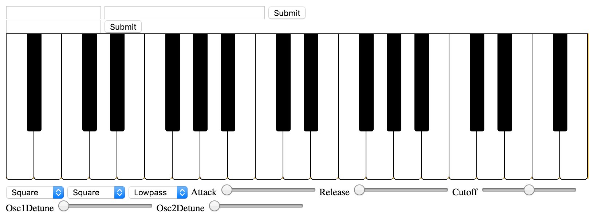
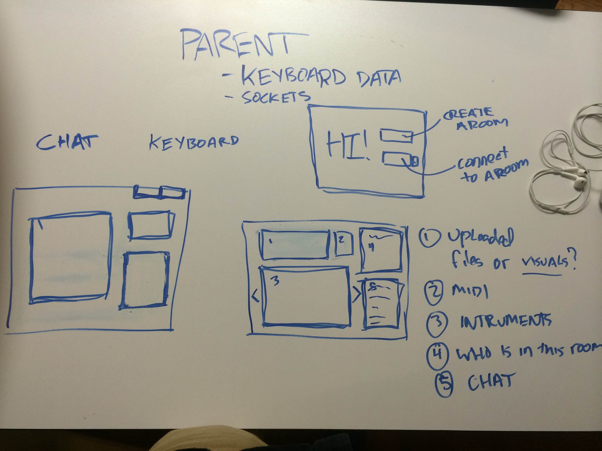
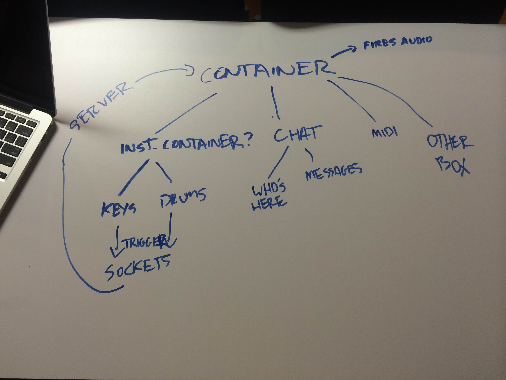

# Macaroni

The goal of _Macaroni_ is to build an interactive web application that lets users 'jam' with their friends via the Web Audio API and socket.io.  Users will be able to create a new 'room' similar to a chat room and invite their friends to come and play music with them.  There will be a built-in synthesizer and drum pads, with additional instruments to be added in the future.  By creating an account, users will be able to upload audio samples to use with the drum pads.

#### Technology

_Macaroni_ will use the Web Audio API as the primary means of generating and playing back sounds.  Users will have access to a keyboard on the UI as well as (possibly) the ability to use MIDI controllers or other hardware to control the instruments.

In order to make the jam rooms interactive, _Macaroni_ will use socket.io to send messages to and from clients via a server.  When an audio event is triggered, a message will be sent to the server which will then tell all clients connected to that room to also trigger the audio event.

_Macaroni_ will use node.js, mongoDB, and express for the back end and React for the front end.

#### Potential difficulties

Depending on the speed of the internet connection of the users, there is the potential for lag in time between one person playing a note and the sound triggering on both computers.  In attempt to combat this, the minimum amount of data will be sent via sockets so that the messages travel as fast as possible.  At this point, it is hard to tell how much this will be an issue until a prototypye is launched.  

#### Wireframes

Some starting points for how the UI will look.

A basis for how data will flow in react.  More wireframes to follow soon.
